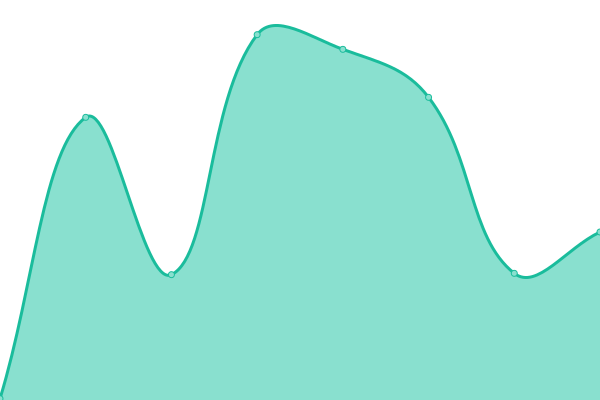
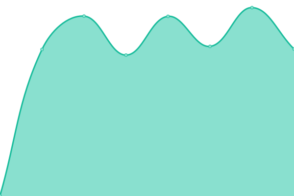

# [📈 Live Status](https://faizur11786.github.io/upptime): <!--live status--> **🟩 All systems operational**

This repository contains the open-source uptime monitor and status page for [Faizur Rahman](https://faizur11786.github.io/upptime), powered by [Upptime](https://github.com/upptime/upptime).

With [Upptime](https://upptime.js.org), you can get your own unlimited and free uptime monitor and status page, powered entirely by a GitHub repository. We use [Issues](https://github.com/faizur11786/upptime/issues) as incident reports, [Actions](https://github.com/faizur11786/upptime/actions) as uptime monitors, and [Pages](https://faizur11786.github.io/upptime) for the status page.

<!--start: status pages-->
<!-- This summary is generated by Upptime (https://github.com/upptime/upptime) -->
<!-- Do not edit this manually, your changes will be overwritten -->
<!-- prettier-ignore -->
| URL | Status | History | Response Time | Uptime |
| --- | ------ | ------- | ------------- | ------ |
|  [Sokos](https://sokos.io) | 🟩 Up | [sokos.yml](https://github.com/faizur11786/upptime/commits/HEAD/history/sokos.yml) | 

 1682ms
     
 | 

<a href="https://faizur11786.github.io/upptime/history/sokos">100.00%</a>
    

|  [Dapp Sokos](https://dapp.sokos.io) | 🟩 Up | [dapp-sokos.yml](https://github.com/faizur11786/upptime/commits/HEAD/history/dapp-sokos.yml) | 

 1489ms
     
 | 

<a href="https://faizur11786.github.io/upptime/history/dapp-sokos">100.00%</a>
    

|  [Payapp2](https://payapp2.com) | 🟩 Up | [payapp2.yml](https://github.com/faizur11786/upptime/commits/HEAD/history/payapp2.yml) | 

 1977ms
     
 | 

<a href="https://faizur11786.github.io/upptime/history/payapp2">100.00%</a>
    

|  [Aqarchain.io](https://aqarchain.io) | 🟩 Up | [aqarchain-io.yml](https://github.com/faizur11786/upptime/commits/HEAD/history/aqarchain-io.yml) | 

 207ms
     
 | 

<a href="https://faizur11786.github.io/upptime/history/aqarchain-io">100.00%</a>
    

|  [Eccb 100](https://eccb100.com) | 🟩 Up | [eccb-100.yml](https://github.com/faizur11786/upptime/commits/HEAD/history/eccb-100.yml) | 

 1269ms
     
 | 

<a href="https://faizur11786.github.io/upptime/history/eccb-100">100.00%</a>
    

|  [Payapp2 Link](https://link.payapp2.com) | 🟩 Up | [payapp2-link.yml](https://github.com/faizur11786/upptime/commits/HEAD/history/payapp2-link.yml) | 

 714ms
     
 | 

<a href="https://faizur11786.github.io/upptime/history/payapp2-link">100.00%</a>
    

|  [Console Sokos](https://console.sokos.io) | 🟩 Up | [console-sokos.yml](https://github.com/faizur11786/upptime/commits/HEAD/history/console-sokos.yml) | 

 992ms
     
 | 

<a href="https://faizur11786.github.io/upptime/history/console-sokos">100.00%</a>
    

<!--end: status pages-->

[**Visit our status website →**](https://faizur11786.github.io/upptime)

## 📄 License

- Powered by: [Upptime](https://github.com/upptime/upptime)
- Code: [MIT](./LICENSE) © [Anand Chowdhary](https://anandchowdhary.com), supported by [Pabio](https://pabio.com)
- Data in the `./history` directory: [Open Database License](https://opendatacommons.org/licenses/odbl/1-0/)
